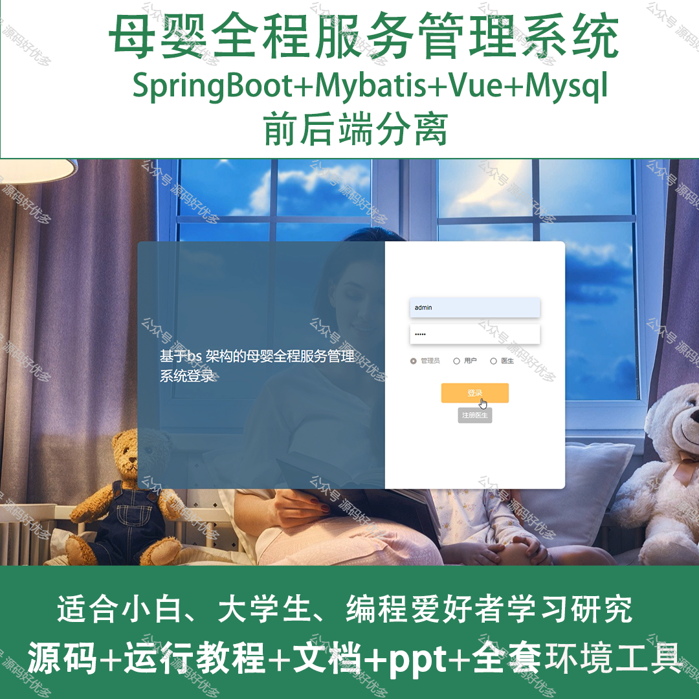
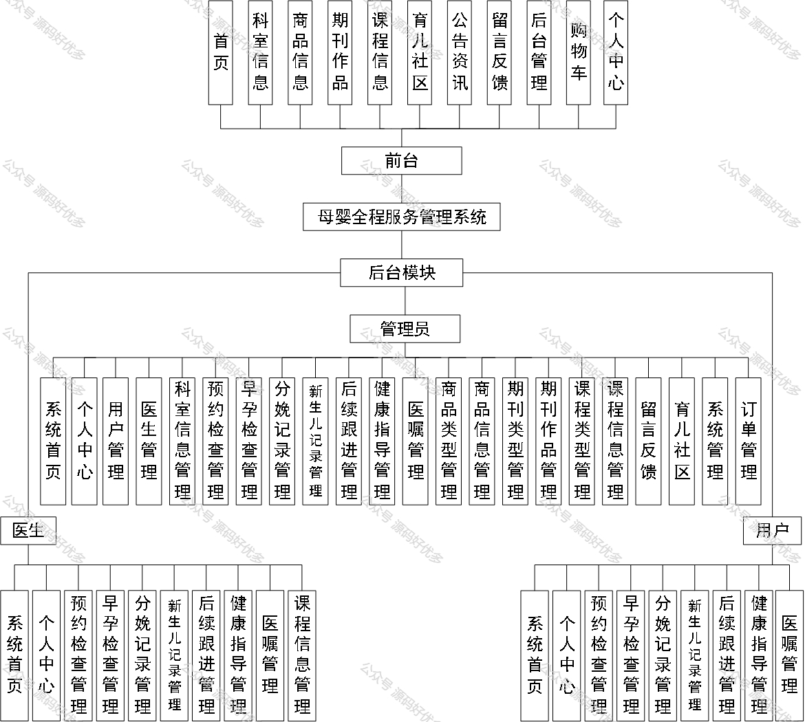
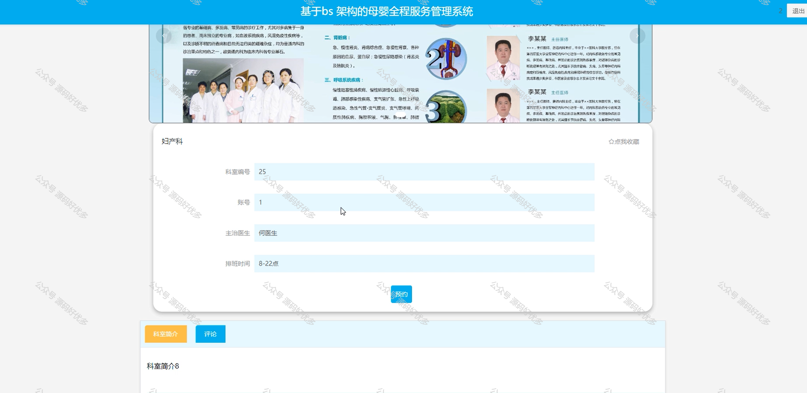
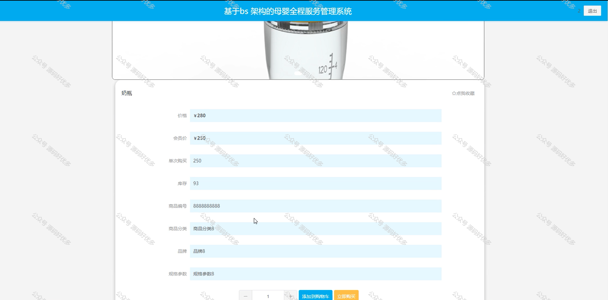
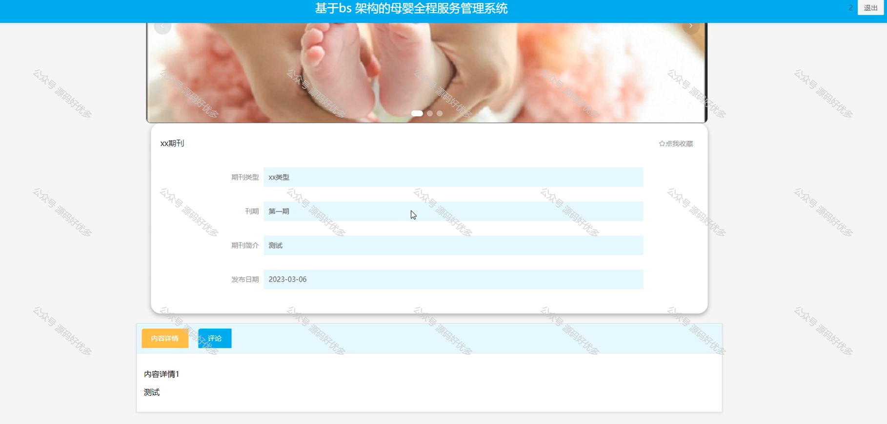
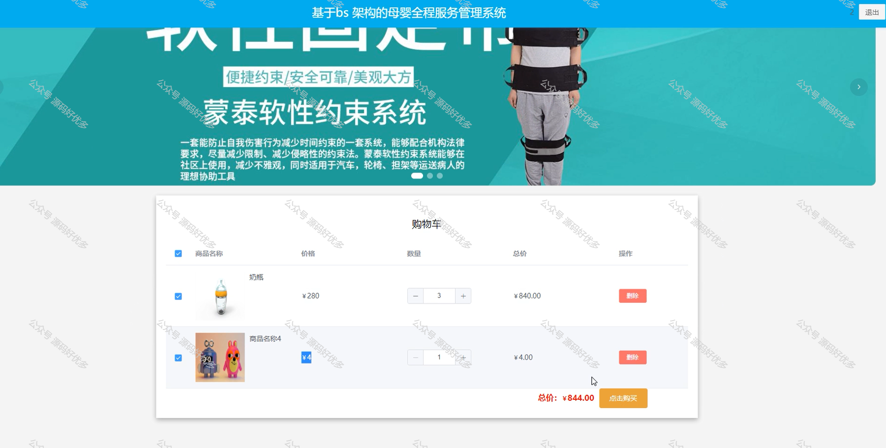
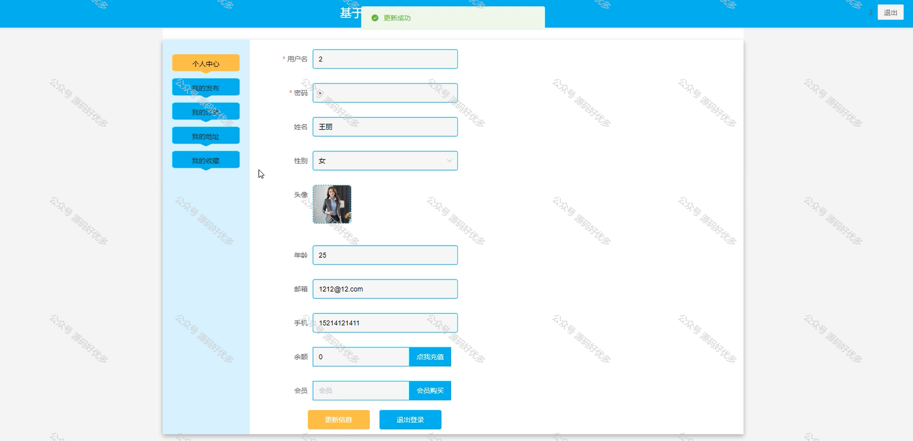
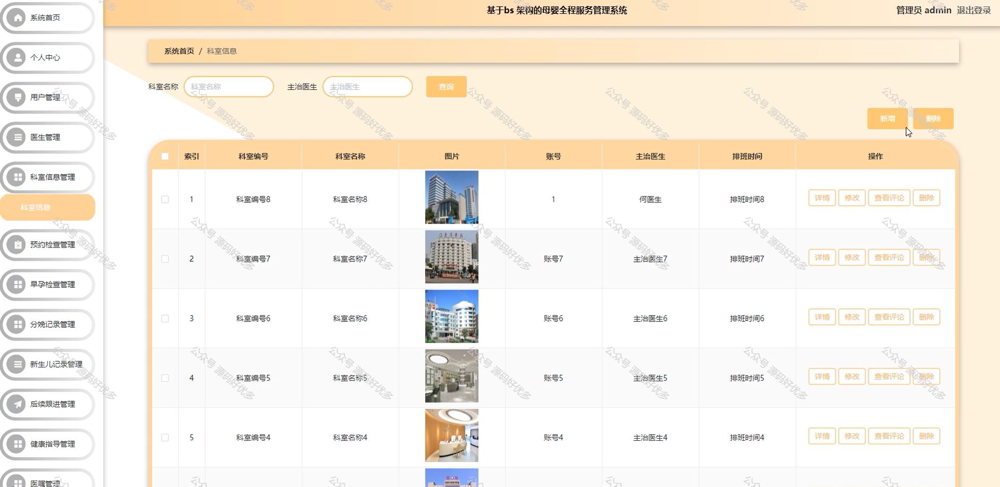
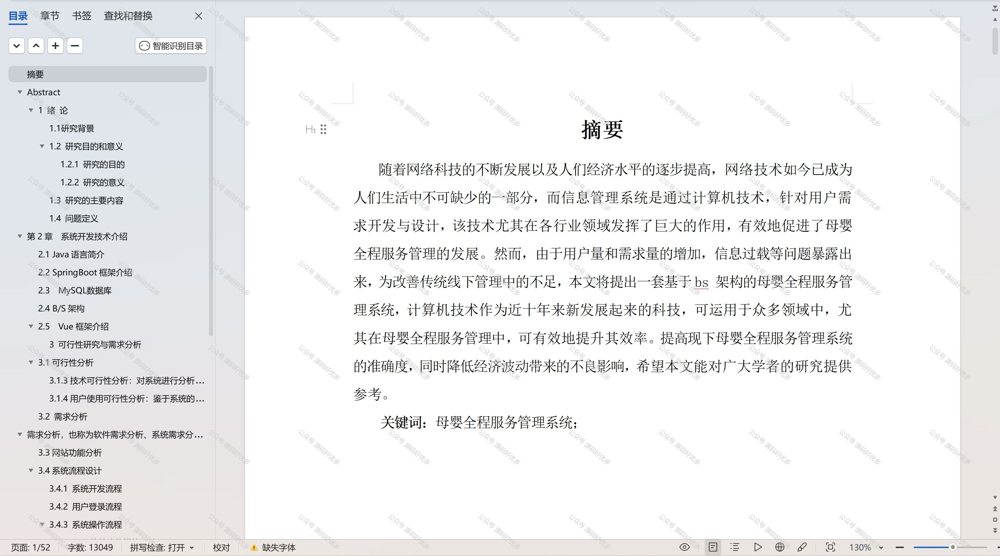

 
## 查看主页获取源码

### 一、作品包含

源码+数据库+设计文档万字+PPT+全套环境和工具资源+部署教程

### 二、项目技术

前端技术：Html、Css、Js、Vue、Element-ui

数据库：MySQL

后端技术：Java、Spring Boot、MyBatis

  

### 三、运行环境

开发工具：IDEA/eclipse

数据库：MySQL5.7

数据库管理工具：Navicat10以上版本

环境配置软件： JDK1.8+Maven3.6.3

前端Nodejs：14

### 四、项目介绍
项目编号：springbootA200

在现代社会，随着人们对母婴健康重视程度的不断提升，以及二胎政策的放开，母婴市场需求日益增长。母婴全程服务管理系统在这样的背景下应运而生，它通过整合线上线下资源，为孕产妇和新生儿提供全方位、一体化的健康管理服务。该系统不仅能够满足母婴群体的基本护理需求，从而有效提升母婴健康水平，增强用户体验，推动母婴服务行业的转型升级。

前台用户功能：首页、科室信息、商品信息、期刊作品、课程信息、育儿社区、公告资讯、留言反馈、后台管理、购物车和个人中心。

后台分为管理员、用户、医生
管理员的功能：系统首页、个人中心、用户管理、医生管理、科室信息管理、预约检查管理、早孕检查管理、分娩记录管理、新生儿记录管理、后续跟进管理、健康指导管理、医嘱管理、商品类型管理、商品信息管理、期刊类型管理、期刊作品管理、课程类型管理、课程信息管理、留言反馈、育儿社区、育系管理、订单管理。
用户的功能：系统首页、个人中心、预约检查管理、早孕检查管理、分娩记录管理、新生儿记录管理、后续跟进管理、健康指导管理、医嘱管理。
医生的功能：系统首页、个人中心、预约检查管理、早孕检查管理、分娩记录管理、新生儿记录管理、后续跟进管理、健康指导管理、医嘱管理、课程信息管理。

### 五、运行截图

  
